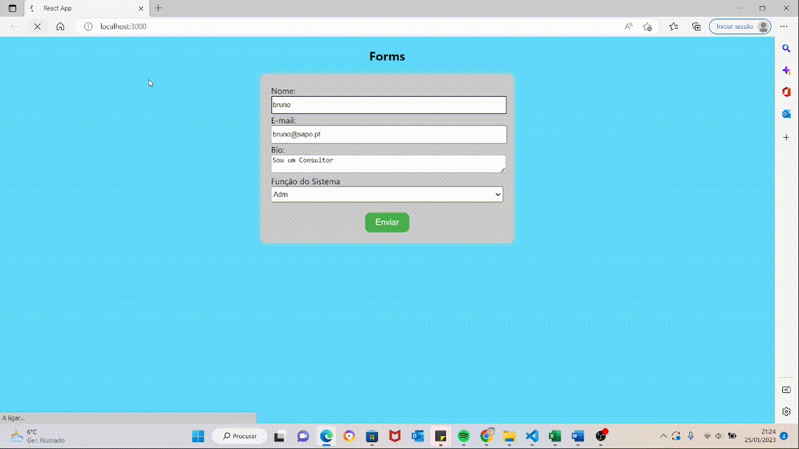

### 💻Form

To create a React login, we need to create a form where users can enter their name, email, etc. Using React components, state, and event handlers, we can get this data sent to the server to verify that the information is valid and allow access. We can also use additional libraries to manage and validate this data. In the end, we can store the user's information so that he doesn't have to log in again.

Let's start a little experiment using forms in React.

#### What was developed:

- Create a new component called "Form" using the "create-react-app" function;
- In the "MyForm" component, add a basic HTML form with two input fields for "name", "email", "Bio and "System role" and a "submit" button;
- Add state to component to store input field values. This can be done using the "useState" hook;
- Add event handlers to input fields to update state when field values change;
- Sending the Form;
- Reset Forms;
- Only a basic CSS was used for demonstration.

  
 

<h1 align="center">

</h1>

### 🧪 Tools

Application developed using the following tools:

- [HTML5](https://www.w3schools.com/html/default.asp)
- [CSS3](https://www.w3schools.com/css/default.asp)
- [Boostrap](https://getbootstrap.com/)
- [React](https://reactjs.org/)

